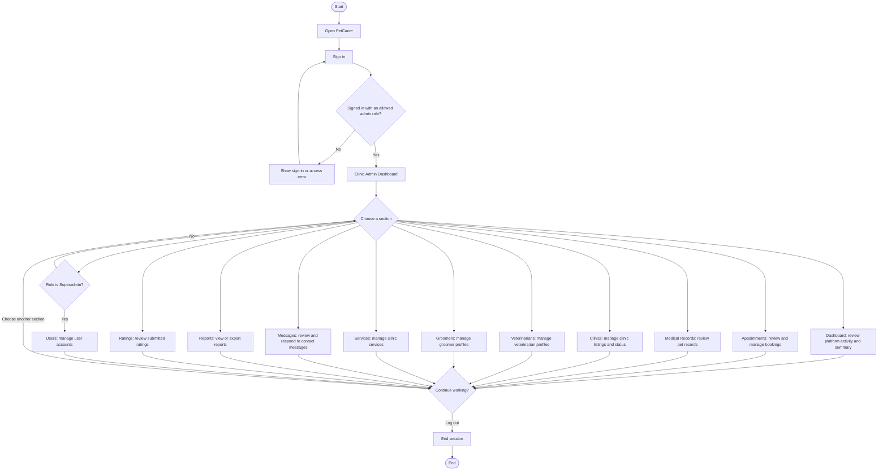

# Clinic Admin Flowchart

This flowchart reflects the Clinic Admin dashboard navigation in `includes/sidebar_admin.php`. Users management is shown only for accounts with the Superadmin role.

```mermaid
flowchart TD
    A([Start]) --> B[Open PetCare+]
    B --> C[Sign in]
    C --> D{Signed in with an allowed admin role?}
    D -- No --> E[Show sign-in or access error]
    E --> C
    D -- Yes --> F[Clinic Admin Dashboard]

    F --> G{Choose a section}
    G --> H[Dashboard: review platform activity and summary]
    G --> I[Appointments: review and manage bookings]
    G --> J[Medical Records: review pet records]
    G --> K[Clinics: manage clinic listings and status]
    G --> L[Veterinarians: manage veterinarian profiles]
    G --> M[Groomers: manage groomer profiles]
    G --> N[Services: manage clinic services]
    G --> O[Messages: review and respond to contact messages]
    G --> P[Reports: view or export reports]
    G --> Q[Ratings: review submitted ratings]
    G --> R{Role is Superadmin?}
    R -- Yes --> S[Users: manage user accounts]
    R -- No --> G

    H --> T{Continue working?}
    I --> T
    J --> T
    K --> T
    L --> T
    M --> T
    N --> T
    O --> T
    P --> T
    Q --> T
    S --> T
    T -- Choose another section --> G
    T -- Log out --> U[End session]
    U --> V([End])
```
